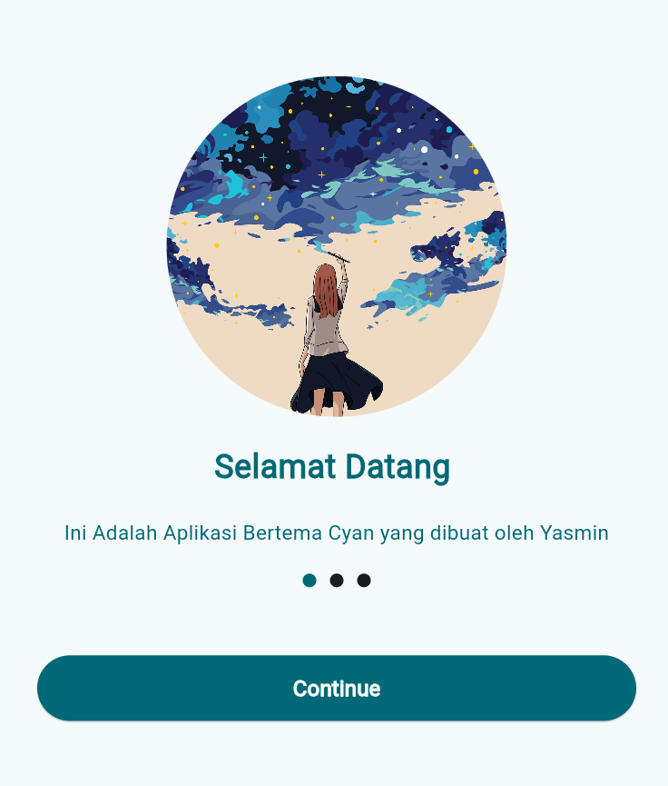
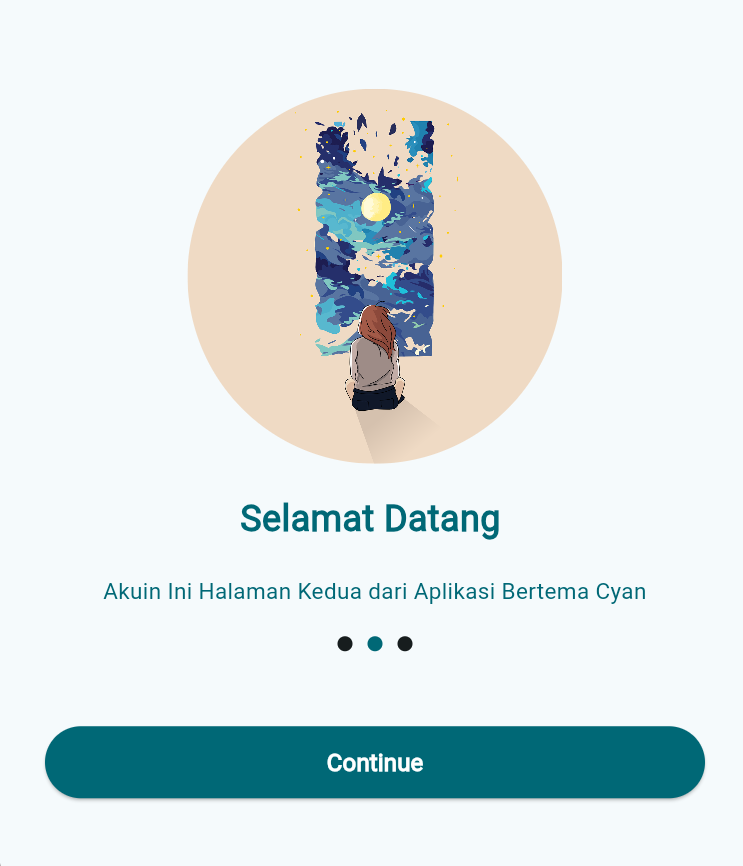
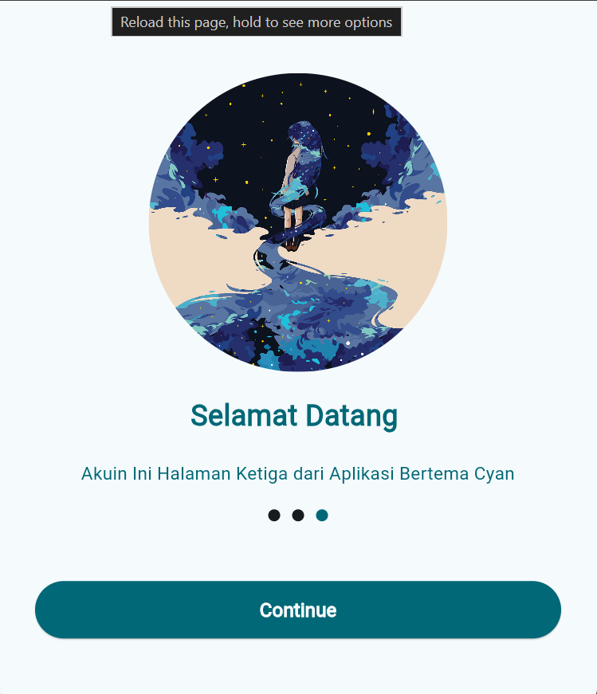
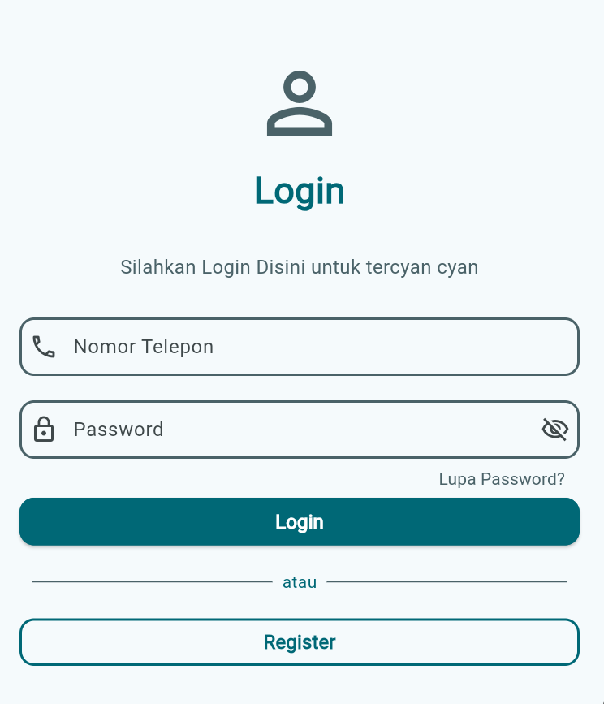

# UTS Pemrogramman Mobile (KB1179) - Semester Ganjil 2025/2026

Repository ini berisi _source code_ dan hasil pengerjaan Ujian Tengah Semester (UTS) mata kuliah Pemrogramman Mobile (Flutter).

---

### 👤 Informasi Mahasiswa

| Keterangan       | Data                         |
| :--------------- | :--------------------------- |
| **Nama Lengkap** | Aulia Yasmin Maharani        |
| **NIM**          | 1123150146                   |
| **Mata Kuliah**  | Pemrogramman Mobile (KB1179) |
| **Dosen**        | IKetut Gunawan               |
| **Repository**   | `KB1179-1123150146-uts`      |

---

### 🎨 Verifikasi Tema Warna (Wajib)

Sesuai instruksi ujian, tema warna aplikasi ditentukan oleh digit terakhir NIM.

- **NIM:** 1123150146
- **Digit Terakhir:** 6
- **Seed Color (Sesuai Tabel):** `Colors.cyan`
- **Implementasi:** Tema telah diatur menggunakan Material 3 (`useMaterial3: true`) dengan `ColorScheme.fromSeed(seedColor: Colors.cyan)`.

---

### 📱 Hasil Screenshot Aplikasi

Berikut adalah hasil tangkapan layar (screenshot) aplikasi yang telah dibuat dan dijalankan.

#### 1. Tampilan Onboarding / Splash Screen

Tampilan _onboarding_ terdiri dari tiga halaman yang menunjukkan pengenalan aplikasi.

|                  Halaman 1                   |                  Halaman 2                   |                  Halaman 3                   |
| :------------------------------------------: | :------------------------------------------: | :------------------------------------------: |
|  |  |  |

#### 2. Tampilan Login

Tampilan untuk pengguna melakukan autentikasi (masuk).



---

### 🚀 Cara Menjalankan Project

Berikut adalah instruksi untuk menjalankan proyek ini pada perangkat lokal.

1.  **Clone Repository**

    ```bash
    git clone [https://github.com/yaseumine/KB1179-1123150146-uts.git](https://github.com/yaseumine/KB1179-1123150146-uts.git)
    ```

2.  **Masuk ke Direktori Project**

    ```bash
    cd KB1179-1123150146-uts
    ```

3.  **Install Dependencies**
    Jalankan perintah berikut untuk mengunduh semua paket yang diperlukan.

    ```bash
    flutter pub get
    ```

4.  **Jalankan Aplikasi**
    Pastikan emulator Anda sudah berjalan atau perangkat fisik sudah terhubung, lalu jalankan:
    ```bash
    flutter run
    ```

---

### 📝 Catatan Kendala

"Tidak ada kendala spesifik yang dihadapi selama pengerjaan proyek."
